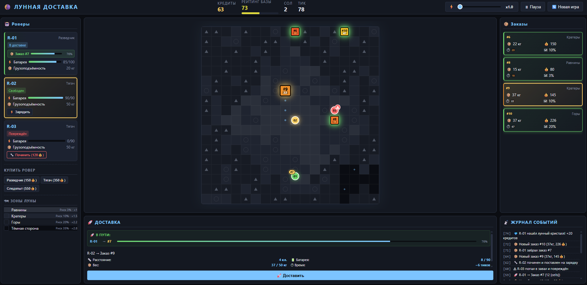
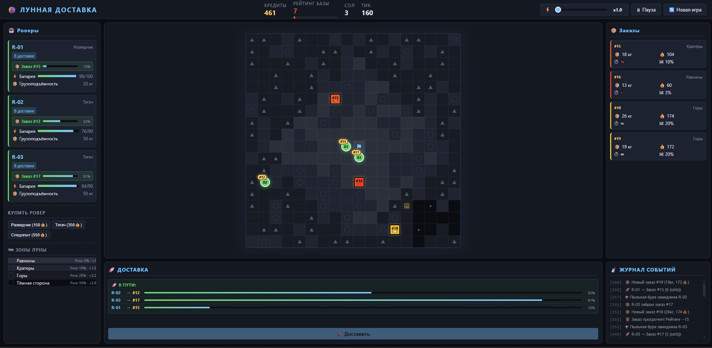

# Лунная Доставка (Lunar Delivery Simulator)

Небольшой игровой симулятор логистики на Луне. Управляйте парком роверов, выполняйте заказы на доставку пайков, учитывайте вес груза, заряд батареи и риски лунных зон, чтобы заработать максимум кредитов и не потерять рейтинг базы.

## Как запустить
1. Скачайте или склонируйте файлы проекта (`index.html`, папки `css/` и `js/`).
2. Откройте файл `index.html` в любом современном браузере (Chrome, Firefox, Edge).
3. *Рекомендация*: Для корректной работы `IndexedDB` в некоторых браузерах лучше использовать локальный сервер или по ссылке https://mediumdeveloper.ru/, хотя игра работает и при прямом открытии файла.

## Что реализовано
- **Карта Луны**: Сетка 18x18 с 5 типами зон (База, Равнины, Кратеры, Горы, Тёмная сторона), каждая со своим уровнем риска и множителем времени.
- **Роверы**: 3 типа (Разведчик, Тягач, Следопыт) с разными характеристиками батареи, грузоподъёмности и скорости. Возможность покупки и ремонта.
- **Заказы**: Генерируются динамически с параметрами веса, награды, срочности (убывает со временем) и риска.
- **Игровой цикл**: Автоматическое обновление состояния (тики), движение роверов по карте, списание батареи, шанс поломки.
- **Условие проигрыша**: Если рейтинг базы падает до 0 (из-за просроченных заказов), игра заканчивается.

## Как работает логика
1. **Вес и батарея**: Расход батареи рассчитывается по формуле:  
   `batteryCost = distance * (1 + weight / capacity) * (1 + avgRisk * 2)`.  
   Тяжёлый заказ пропорционально увеличивает расход энергии.
2. **Риск**: При каждом тике движения ровер проверяет зону, в которой находится. Если `Math.random() < zone.risk * 0.5`, ровер ломается, заказ проваливается, требуется платный ремонт.
3. **Проверка доставки**: Перед запуском функция `canDeliver` проверяет: не сломан ли ровер, свободен ли он, хватает ли грузоподъёмности и заряда батареи на весь маршрут (туда и обратно). Если нет — кнопка блокируется с указанием причины.
4. **Маршрутизация**: Используется упрощённое манхэттенское расстояние (движение только по вертикали и горизонтали) для построения пути.

## Хранение данных
Все данные сохраняются локально в браузере с помощью **IndexedDB** (база `lunar_delivery_db`).  
Используются следующие хранилища (Object Stores):
- `state`: деньги, репутация, текущий сол и тик, флаг паузы/конца игры.
- `rovers`: массив роверов с их координатами, статусом и зарядом.
- `orders`: список заказов и их текущий статус.
- `deliveries`: активные процессы доставки (маршрут, текущий шаг).
- `events`: журнал событий для отображения в интерфейсе.
- `zones`: сгенерированная карта (чтобы не пересоздавать её при перезагрузке).

## Использование ИИ
При разработке тестового задания использовалась языковая модель **Qwen** (https://chat.qwen.ai/)